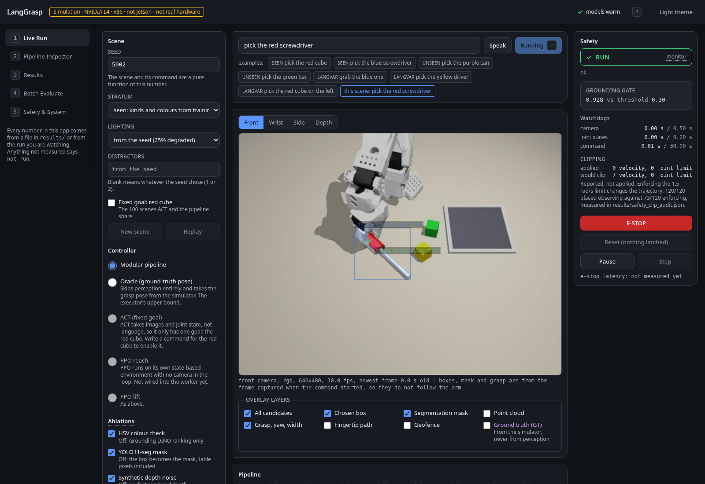

# LangGrasp: language-guided pick-and-place with a measured edge stack (simulation)

"Pick the blue screwdriver" -> open-vocabulary grounding -> YOLO11-seg mask -> depth fusion and grasp pose
-> a 5-DOF SO-101 arm picks it and places it in a tray. This repository is the complete software stack of
the LangGrasp plan (modular pipeline, ACT imitation policy, PPO with domain randomisation, safety monitor
with an ISO 26262 / SOTIF style FMEA, ROS 2 node graph, TensorRT export and latency budgets), built and
evaluated end to end against a MuJoCo simulation of the SO-ARM100/SO-101 because no arm, RGB-D camera or
Jetson was available.

Everything numeric in this repo was measured on this machine (NVIDIA L4, x86 EC2 host) and is written by
scripts into `results/*.json`; `docs/RESULTS.md` is generated from those files and is the only place to
read numbers from. Nothing here is a hardware measurement. See `docs/HARDWARE_PLAN.md` for what changes
on the physical system.

## What is in the box

| Track | Implementation | Measured |
|---|---|---|
| Simulation + executor | MuJoCo scene with the Menagerie SO-ARM100 model, seeded scenarios in three strata (seen / unseen / language variation), damped-least-squares IK, scripted Cartesian pick-and-place with a fixed-jaw offset and tracking correction | oracle success by stratum and object kind, reachability map |
| Language | rule-based parser (action, colour, noun, spatial reference), faster-whisper speech-to-text with a typed fallback | STT latency per model size on L4 |
| Grounding | Grounding DINO tiny once per command, HSV colour verification, spatial resolver, generic-object fallback for unknown synonyms | grounding accuracy per language variant, with and without the colour check |
| Segmentation | YOLO11n-seg fine-tuned on rendered data (labels from the simulator's segmentation buffer), ONNX opset 17 static, TensorRT FP16 and INT8 engines | mAP per export, batch-1 latency per backend |
| Depth fusion | pinhole back-projection, table/outlier removal, PCA grasp axis, thickest-segment grasp point for elongated objects | grasp centre / yaw error vs ground truth, with a synthetic depth-noise model |
| ACT | scripted demos into a LeRobotDataset, LeRobot ACT training, closed-loop evaluation on the same seeds as the modular pipeline (fixed goal) | success with Wilson CI vs oracle, policy latency |
| RL | vectorised state-based MuJoCo env, minimal PPO, Squint-style domain randomisation, sim-to-sim gap table (no real robot) | success nominal vs shifted dynamics, DR ablation |
| Safety | SafetyMonitor: stale-topic watchdog, joint and velocity limits, TCP geofence, grounding confidence gate with ambiguity flag, e-stop latch, reduced-speed mode; FMEA H1-H8 | unit and in-sim integration tests |
| ROS 2 | Humble package with driver, command, grounding, grasp, policy, safety and latency-tracer nodes | pipeline smoke in a `ros:humble` container, per-stage latency |
| Evaluation | stratified protocol, Wilson 95% intervals, per-stage latency tracer, generated results page | `docs/RESULTS.md` |

## Quick start

See `docs/DEMO_GUIDE.md`. Short version:

```bash
make gui                                                        # the live web GUI on :8000
MUJOCO_GL=egl .venv/bin/python scripts/smoke_pick.py 20         # scripted picks, no perception
MUJOCO_GL=egl .venv/bin/python scripts/make_video.py --approach modular   # full pipeline demo video
make gate                                                       # ruff + pytest + frontend unit tests
make report                                                     # regenerate docs/RESULTS.md
```

## The web GUI

**Try it without installing anything: https://huggingface.co/spaces/pavanyadava07/langgrasp** replays a
recorded command through the real interface and serves the measured results from file.

`make gui` starts the API, the simulation worker and the built frontend on one port, and binds the loopback
interface only, because this interface can move the arm. Reach it through an SSH tunnel:

```bash
ssh -L 8000:localhost:8000 <host>     # then open http://localhost:8000
GUI_PORT=8010 make gui                # if 8000 is taken; forward that port instead
```

Five views, designed around three people: someone who has 60 seconds and wants to watch one pick, the
engineer debugging a failure, and a safety reviewer.

| View | What it is for |
|---|---|
| Live Run | Type or speak a command, watch the front, wrist, side or depth camera with the grounding candidates, the chosen box, the YOLO mask, the point cloud and the grasp pose drawn over it, follow the nine pipeline stages with their latencies, and read the outcome. The safety rail is always visible, with the monitor's state, its watchdog ages, the grounding gate against its threshold, and a latched E-STOP. |
| Pipeline Inspector | Step a recorded run tick by tick at 10 Hz: the camera frame, joint angles against the targets commanded that tick, the fingertip height and its distance to the commanded grasp point, and a per-stage latency waterfall. |
| Results | Every measured number in `results/*.json`, each card naming its file and that file's timestamp. Nothing is computed in the browser except differences between two measured rates. |
| Batch Evaluate | Run the protocol or a subset through the same harness the scripts use, with a live per-scene grid; a cell opens that seed in Live Run. It writes to a timestamped file and will not overwrite a published one without being told twice. |
| Safety & System | The FMEA hazard table, each row with the code that implements the mitigation, the test that exercises it, and whether it is tested here or needs hardware that does not exist in this project. Plus versions, model load state and the engines on disk. |



What the GUI does not do: it adds no behaviour to the pipeline. Stage events come from optional hooks at the
boundaries that already existed, and a test runs the same ten seeds with the hooks on and off and demands
identical results. The safety monitor observes by default rather than enforcing, because enforcing its
velocity limit changes the trajectory, measured at 120/120 placements observing against 73/120 enforcing
(`results/safety_clip_audit.json`). Speech is transcribed into the command box and never executed on its own.
Ground-truth overlays are dashed, tagged, and off by default. A command the scene was not generated for is
reported as ungraded rather than scored as a failure.

Measured on this host through the browser: e-stop from click to the arm being held 3.2 ms median while
moving, 10 fps on the front camera during a paced run, accessibility 100 in Lighthouse, and no axe-core
violations across the five views in both themes.

Two more ways to run it: `docker/Dockerfile.cpu-demo` runs everything on a CPU with software rendering, about
23 s per command on two cores against 682 ms on the L4; and `scripts/export_static_gui.py` exports the
interface as a static site that replays a recorded run, which is what the Space above serves.

## Results

All numbers are from `docs/RESULTS.md` (generated from `results/*.json`; NVIDIA L4, MuJoCo simulation,
Wilson 95% intervals). Highlights:

| What | Measured |
|---|---|
| Oracle executor (ground-truth grasp point, no perception), 120 stratified trials | 120/120 placed (CI 97-100) after the pre-grasp jaw opening was reduced to 4 cm (screwdrivers went from 38/41 to 41/41) |
| Modular language pipeline, same 120 trials | 115/120 placed (95.8%, CI 91-98); grounding correct 115/119 (96.6%); seen 39/40, unseen 39/40, language variation 37/40; 4 of the 5 failures are wrong-object groundings, the fifth is the confidence gate refusing a 0.27-score match |
| Colour-check ablation (Grounding DINO ranking only) | 106/120; language-variation stratum drops from 37/40 to 32/40 and grounding accuracy from 96.6% to 89.2% |
| Box-only mask ablation (no YOLO11-seg) | 106/120; screwdrivers drop from 39/41 to 30/41 and no-grasp aborts rise from 1 to 7 |
| Fixed-goal red cube, 100 identical scenes | oracle 100/100, modular 90/100, ACT (LeRobot, scripted demos) 55/100 with 240 demos at 192 px and 25k steps; a third attempt with 700 demos, a cropped view and start-pose jitter plateaued at 47/100 (30k steps) and 49/100 (60k steps); the first attempt (120 demos, 128 px) placed 6/100 and was diagnosed as a 1-3 cm lateral offset at the grasp that the fixed-jaw executor cannot absorb, see `docs/ACT.md` |
| YOLO11n-seg fine-tuned on 1602 rendered images | box mAP50 0.985, mask mAP50 0.984 (synthetic val); batch-1 inference median 7.0 ms PyTorch, 3.3 ms ONNX Runtime CUDA, 0.81 ms TensorRT FP16, 0.70 ms TensorRT INT8 (end to end with mask decode 10.7 / 5.1 / 4.6 / 4.5 ms) |
| INT8 vs FP16 | INT8 saves 0.1 ms and costs about 1 point of box mAP50-95 (0.934 to 0.924) on this model: not worth it, as the plan predicted for small models |
| Depth fusion vs ground truth (ground-truth masks, 314 objects) | cube 0.3 mm, can 0.6 mm, screwdriver 2.8 mm median centre error; yaw error under 5 deg (p95); screwdriver p95 16.6 mm from partially occluded handles |
| PPO reach, sim-to-sim gap (200 episodes per cell) | no DR: 100% nominal, 83% shifted dynamics, 40% with 2-tick latency; with DR: 100% / 97.5% / 54.5% |
| PPO lift | no DR: 94% nominal, 51% shifted, 33% with 2-tick latency; with DR: 0% after 5.6 M steps (documented negative result) |
| faster-whisper on the L4 (read speech, not commands) | median 140 ms (tiny), 194 ms (base), 295 ms (small) per clip |
| ROS 2 Humble pipeline in a `ros:humble` container (CPU only) | full pick executed through 7 nodes; camera frame to first safe joint command 57 ms end to end; safety node adds 1.0 ms median |
| Grounding DINO tiny per command on the L4 | about 300 ms when the GPU is otherwise idle (see the clean latency bench in RESULTS.md section 3) |

Per-track write-ups: `docs/PERCEPTION.md`, `docs/ACT.md`, `docs/RL.md`, `docs/FMEA.md`, `docs/ROS2.md`,
`docs/DOCKER.md`.

## Honest scope

- Simulation only. The RGB-D camera is a rendered pinhole camera with a simple synthetic noise model; the
  arm is the Menagerie MJCF with position servos; demos are scripted, not teleoperated.
- Latency is measured on an NVIDIA L4 (about 30 TFLOPS FP16 class) and says nothing about the Jetson Orin
  Nano; TensorRT engines are device specific and must be rebuilt there.
- The "sim-to-real" gap of the brief is reported as a sim-to-sim gap (nominal versus shifted dynamics).
- SmolVLA, learned 6-DOF grasping and Isaac Lab / ManiSkill3 were not attempted (scope-cut order of the plan).
- Lying cylinders were the executor's weak spot (screwdriver handles rolled when the moving finger swept
  in from a wide opening); reducing the pre-grasp opening to 4 cm fixed it in simulation (60/60), but the
  plan's top risk, SO-101 precision on a real arm, is untested here.
- PPO with the full domain-randomisation set never learned the lift within the 40-minute budget; the
  reach task shows the intended DR effect (97.5% vs 83% under shifted dynamics).

## Mapping to the five focus areas of the target internship

Deep learning (ACT, YOLO11-seg fine-tune), multimodal AI (language grounding with Grounding DINO and
speech input), robot manipulation (IK executor, grasp synthesis, ACT rollouts), vision engineering
(synthetic data, ONNX/TensorRT export, measured latency budgets, depth fusion) and reinforcement learning
(PPO with domain randomisation and a gap study). The safety analysis (`docs/FMEA.md`) is written the way an
automotive functional-safety engineer would write it for a benchtop cobot.

## License

MIT for this repository. The SO-ARM100 model files under `langgrasp/sim/assets/so_arm100` are from the
MuJoCo Menagerie (Apache-2.0, license file included). Grounding DINO, YOLO11 (AGPL-3.0 for Ultralytics
code and weights) and LeRobot keep their own licenses.

Author: Pavan Yadav Annappa.
