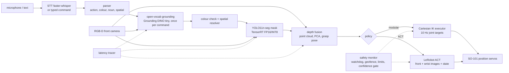

# Architecture

LangGrasp turns a typed or spoken command ("pick the blue screwdriver") into a pick-and-place on a
5-DOF SO-ARM100/SO-101 arm. This repository implements the complete software stack against a MuJoCo
simulation of the arm (Apache-2.0 model from the MuJoCo Menagerie) because no physical arm, camera or
Jetson was available. Every measured number in this repo comes from that simulation on an NVIDIA L4 GPU
(x86 EC2 host); the hardware plan in HARDWARE_PLAN.md says what changes on the real system.

## Data flow

## Packages

| Path | What it is |
|---|---|
| `langgrasp/sim` | MuJoCo scene (arm, table, tray, object pool), scenario generator (seen / unseen / language-variation strata), damped-least-squares IK, scripted Cartesian pick-and-place executor |
| `langgrasp/language` | rule-based command parser; faster-whisper speech-to-text wrapper with text fallback |
| `langgrasp/perception` | Grounding DINO wrapper with colour verification and spatial resolution, YOLO11-seg wrapper (PyTorch / ONNX Runtime / TensorRT), synthetic dataset renderer, export + benchmark, depth fusion and grasp pose |
| `langgrasp/policies/modular.py` | the stage functions composed into one pipeline with per-stage timing |
| `langgrasp/policies/act` | scripted-demo collection into a LeRobotDataset, ACT training and closed-loop runner |
| `langgrasp/policies/rl` | vectorised state-based MuJoCo env, minimal PPO, domain randomisation, sim-to-sim gap evaluation |
| `langgrasp/safety` | SafetyMonitor (stale-topic watchdog, joint/velocity limits, TCP geofence, confidence gate, e-stop latch, reduced-speed mode); FMEA in docs/FMEA.md |
| `langgrasp/eval` | stratified protocol, Wilson intervals, latency tracer, RESULTS.md generator |
| `langgrasp/bus.py` | in-process pub/sub with ROS 2-like topics for running without ROS 2 |
| `ros2_ws/src/langgrasp_ros` | ROS 2 Humble package with the node graph from the plan (driver, command, grounding, grasp, policy, safety, latency tracer) |
| `docker` | workstation image (verified build noted in DOCKER.md) and an untested Jetson image |

## Control and timing

- Physics: MuJoCo, 2 ms step, `implicitfast`; control at 10 Hz (50 substeps per tick), the rate used by
  several SO-101 LeRobot setups and by the Squint sim-to-real work.
- Executor: Cartesian waypoints (approach, hover, descend, close, lift, transport, lower, release,
  retreat) with IK every tick, a relaxed orientation term for transit phases (the 5-DOF arm cannot hold a
  top-down pose above about 6.5 cm at the workspace edge), an x/y integral tracking correction for servo
  sag, and a fixed-jaw offset (the SO-101 gripper has one fixed and one moving finger).
- Measured reachability of the strict top-down pose: within a 0.27 m radius up to 6.5 cm fingertip
  height; relaxed up to 8.5 cm (`langgrasp/sim/kinematics.py`, grid in the session log).

## Evaluation protocol

Scenarios are seeded and shared by every approach. Strata: seen objects (kinds and colours present in the
demos and in the YOLO fine-tune), unseen (novel colours purple/orange/pink or the held-out "bar" shape),
language variation (synonyms, attribute-only phrases, spatial references with a duplicate object). Each
trial has 1-2 distractors, random pose, nominal or degraded lighting. Success levels: grounding correct,
grasp (lifted above 5 cm while held), place (in the tray). All rates carry Wilson 95% intervals.
