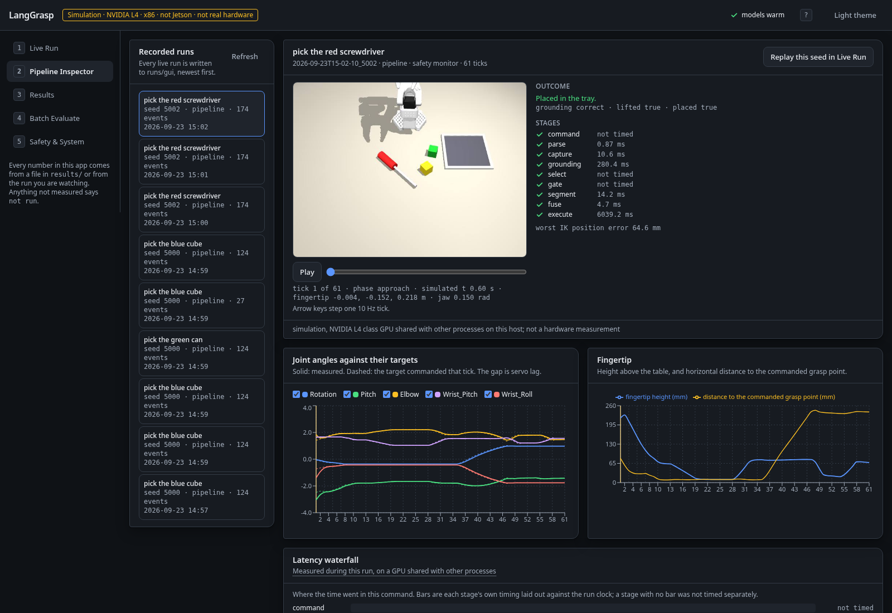
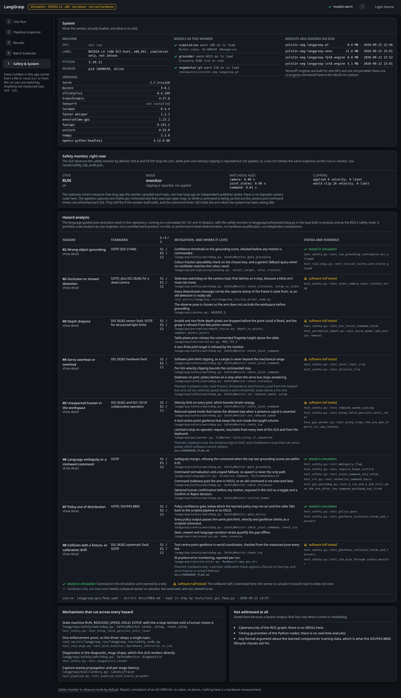

# Demo guide

Everything runs headless on a Linux box with an NVIDIA GPU (tested: L4, driver 580, CUDA 12.6). No robot,
camera or Jetson is needed. Set `MUJOCO_GL=egl` for every command that touches the simulator.

## Setup

```bash
uv venv -p 3.10 .venv
uv pip install -p .venv/bin/python torch==2.7.1 torchvision==0.22.1 --index-url https://download.pytorch.org/whl/cu126
uv pip install -p .venv/bin/python -e ".[perception,learning,speech,dev]"
curl -L -o checkpoints/yolo11n-seg.pt https://github.com/ultralytics/assets/releases/download/v8.3.0/yolo11n-seg.pt
```

The Grounding DINO tiny checkpoint (about 660 MB) is fetched from the Hugging Face Hub on first use.

## The web GUI

One command starts the API, the simulation worker and the built frontend on a single port:

```bash
make gui                      # http://localhost:8000
GUI_PORT=8010 make gui        # when 8000 is taken, which it is on some hosts
```

It binds the loopback interface only, because the interface can move the arm, so reach it through a tunnel:

```bash
ssh -L 8000:localhost:8000 <host>
```

Then open `http://localhost:8000`. The microphone works over this tunnel because browsers treat `localhost`
as a secure context; over a plain LAN address it does not, and the button says so.

Startup takes about 7 seconds on this machine: MuJoCo 0.2 s, Grounding DINO tiny 6 s, YOLO11n-seg 0.6 s. The
header says which models are warm. Add `--grounder oracle` to skip the 660 MB grounding checkpoint and use
the simulator's label map instead, which the UI labels as ground truth.

### The 60-second version

1. Press an example command chip, or the chip that says "this scene", and press Run.
2. Watch the nine stages fill in with their latencies, the candidate boxes appear with their scores and
   colour fractions, the chosen box turn solid, the mask and the grasp marker appear, and the arm move at its
   real 10 Hz.
3. Read the outcome card: grounding correct, grasped and lifted, placed, each graded against the simulator's
   own state, which the pipeline never sees.
4. Press `E` at any point. The arm holds, the rail latches E-STOP and reports the measured latency from your
   click. Press Reset to release it.

Keyboard: `Enter` run, `Space` pause or step, `E` e-stop, `R` replay this seed, `1` to `5` switch view,
`?` for the full list.

### What each view answers

| View | Question |
|---|---|
| Live Run | What does it do, right now, on this scene? |
| Pipeline Inspector | What exactly happened, tick by tick, in a run that already finished? |
| Results | What was measured, with what confidence, and from which file? |
| Batch Evaluate | Run the protocol or a subset and get a file in `results/`. |
| Safety & System | Which hazards are covered, by what code, tested by which test, and what needs hardware? |

### Rebuilding and testing the GUI

```bash
make gui-build     # npm install + vite build into langgrasp/gui/static (the build is committed)
make gui-test      # frontend unit tests: projection maths, formatting, run indexing
make gui-e2e       # nine browser checks against a real worker, about two minutes
make gui-audit     # axe-core accessibility and responsive audit of a running GUI
```

`make gate` runs ruff, the Python suite and the frontend unit tests, skipping the last with a message if
`gui/node_modules` is absent.

## The 5-minute demo

1. Scripted executor sanity check (no perception): `make smoke` prints per-seed grasp/lift/place flags.
2. Full language pipeline on three scenes (seen, unseen, language variation) into a video with a
   latency overlay: `make video`, then open `media/demo.mp4`.
3. Interactive: `python scripts/demo_command.py --seed 5000 --command "pick the blue one"` runs one
   command and prints the decision path (query, candidates, colour fractions, grasp pose, timings).

## Reproduce the numbers

| What | Command | Writes |
|---|---|---|
| Oracle upper bound (120 trials) | `python scripts/eval_oracle.py --n 40` | results/oracle_protocol.json |
| Modular pipeline (120 trials + ablations) | `python scripts/eval_modular.py --n 40` | results/modular_*.json |
| Synthetic YOLO dataset | `python scripts/make_synth_dataset.py` | data/yolo_synth |
| YOLO11n-seg fine-tune | `python scripts/train_yolo.py` | checkpoints/yolo11n-seg-langgrasp.pt, results/yolo_train.json |
| Export + latency bench | `python scripts/export_yolo.py && python scripts/bench_yolo.py` | results/yolo_latency_l4.json |
| Scripted demos -> LeRobotDataset | `python scripts/collect_demos.py` | data/lerobot/langgrasp_pick |
| ACT training / eval | `python scripts/train_act.py`, `python scripts/eval_act.py` | results/act_*.json |
| PPO reach (DR and no DR) + gap table | `python scripts/train_ppo.py --task reach --dr`, `python scripts/eval_ppo.py` | results/ppo_*.json |
| Speech-to-text latency | `python -m langgrasp.language.stt results/stt_latency_l4.json` | results/stt_latency_l4.json |
| ROS 2 pipeline in Docker | see docs/ROS2.md | results/ros2_smoke.json |
| Regenerate the results page | `make report` | docs/RESULTS.md |

`make gate` runs ruff, the full Python suite (simulation tests included) and the frontend unit tests, in
about 80 seconds on this machine.

## Screenshots


A command mid-flight: the front camera with the grounding candidates, the chosen box, the mask and the grasp
marker drawn over it, the nine stages with their latencies below, and the safety rail on the right with the
monitor's state, the watchdog ages, the grounding gate against its threshold and what it would have clipped.



A finished run, stepped tick by tick: the recorded frame, joint angles against the targets commanded that
tick, the fingertip height and its distance to the commanded grasp point, and where the time went.



The hazard table, with the code implementing each mitigation, the test that exercises it, and a status that
separates what was exercised here from what needs hardware this project does not have.

## Talking points for an interview

- Why the executor needs a fixed-jaw offset and an x/y integral correction (SO-101 has one moving
  finger; position servos sag about 1 cm under load at 10 Hz).
- Why grounding runs once per command and why the colour check exists (Grounding DINO tiny scores
  "blue screwdriver" on a yellow screwdriver almost as high as on the blue one; measured).
- What the sim-to-sim gap table can and cannot say about a real robot.
- The FMEA: which mechanisms are in software here, which need hardware telemetry.
